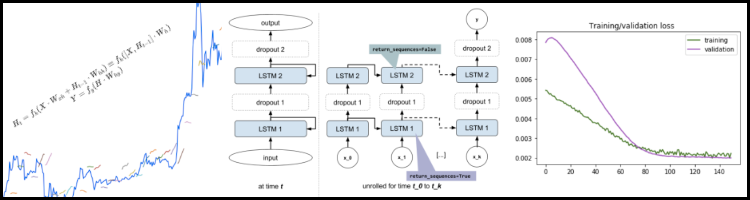

# PREDICTING THE PRICE OF BITCOIN AND THE STOCK PRICES OF BITCOIN-INVOLVED COMPANIES USING LSTM RNNS



## TL;DR
**(If you're not from Udacity, or not already familiar with this because I've bored you to death explaining it, start here.)**

- [Project Report](./report.pdf) (PDF - GitHub will render it to HTML decently)
- [index.ipynb](./index.ipynb) (Jupyter notebook serving as starter point - assume you've glanced through the report)

---
## Requirements

- Python 2.7+ (should work with Python 3.5+ too as all code has proper future imports, but not tested after latest changes)
- requirements from `requirements.txt`

## Setup

(preferably in a virtualenv or docker)

```
pip install -r requirements.txt
```

If on a machine with CUDA capable GPU, also do:

```
pip install -r server-requirements.txt
```

## Running experiments

```
jupyter notebook
```

**Start with** `index.ipynb` Jupyter notebook.

## Running full dataset walk-forward-valiadation

### BTC 24h

Use `full-runs-btc-24h-ohlcw-sp500-sentimen.ipynb` notebook.

### Stocks

Use `full-runs-stocks.ipynb` notebook.

### BTC 5 min

```
python btc-5min-full-run.py
```

(This one can take from a few hours, up to a day, on CUDA GPU machines. Pleas do not try to run on CPU only, it can take days!)
