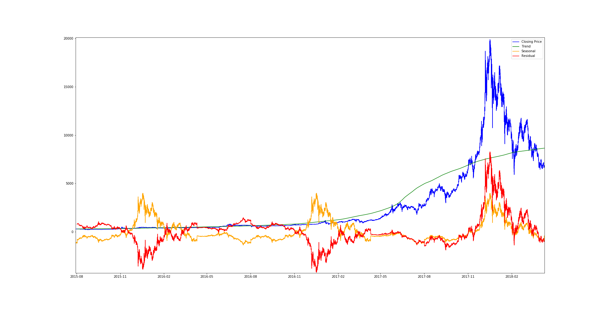
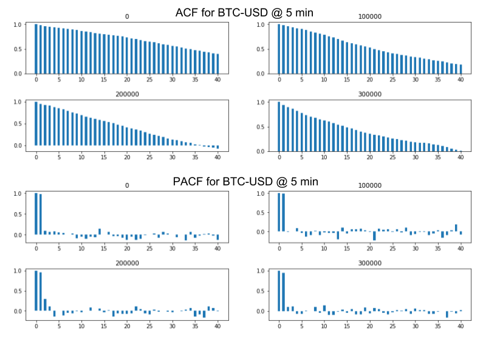
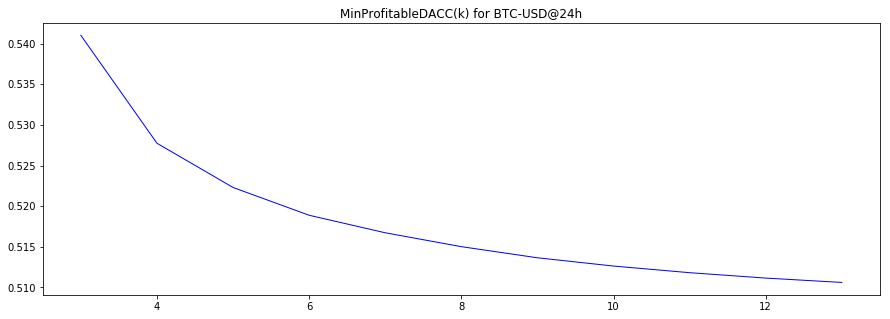
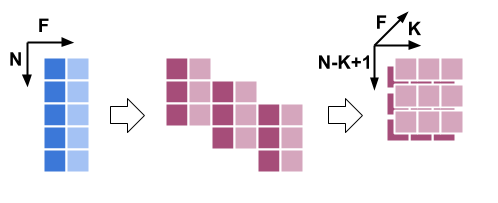
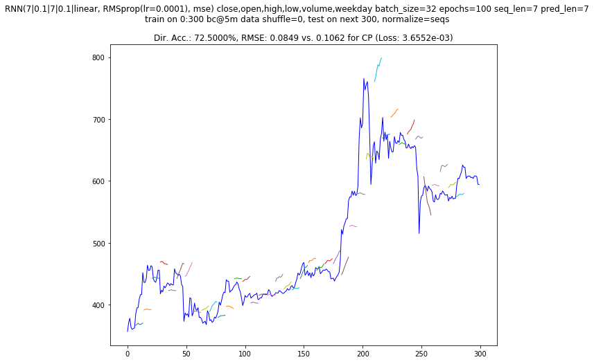

# Capstone Project
Machine Learning Engineer Nanodegree

## I. Definition [1-2 pages]

### Project overview [1-2 paragraphs]

Building **models that can predict the future evolution of easily tradeable financial tools such as stocks, or of crypto-currencies such as Bitcoin**, is a topic of great interest for traders and investors. Such predictions can guide both investment strategies and speculative trading. Using so called **deep leaning techniques** (multi-layered neural networks) to build such models is still in its infancy, and **recurrent neural networks** (RNNs) seem a good fit for this kind time-dependent data. In this report we are interested in building predictive models for trading, investigating whether we can obtain good enough predictions to guide potentially successful trading strategies. The models we are building and tuning are **long short-term memory (LSTM) RNNs**.

These problem we are attacking here is *just one particular case of applying machine learning (ML) to the prediction of time series data.* It is possible that work done on such models could generalize to more "socially useful" time series prediction problems, like *predicting electric energy consumption, water consumption or food prices.*

We will attempt to first **predict the price of Bitcoin (BTC)** in USD based on historical data of medium frequency (5 min) and low frequency (daily) comprised of the regular price values (open, high, low, close) and trading volume, augmented with extra data derived from the S&P 500 Index (SP500) taken as a rough general marker for the "health of US and West-European economy". (A mini-experiment in adding an extra feature representing "Bitcoin related sentiment of recent news" obtained from using Google Clod Natural Language API for sentiment analysis on a subset of news headlines filtered for Bitcoin related keywords was also carried out, but mainly as a proof-of concept for the technique - the actual historical news data was not enough and not diverse enough, and acquiring and processing better quality news data would have increased the scope of this project too much.)

Secondly, we will try to **predict the price of "Bitcoin-involved companies"** (that have either invested in BTC, or are connected to the BTC-ecosystem by producing mining hardware, or by providing relevant services) by using historical data augmented with **features extracted from recent past historical BTC price.**

The data sets used are publicly available historical data for the prices of stock and Bitcoin, acquired from the NASDAQ website, via the GDAX/CoinbasePro API, and from the Bitstamp (a Bitcoin exchange) website, and spans the 2015 - 2018 time interval.

### Problem statement [2-4 paragraphs]

The goals for this project are:
1. To build a model that predicts BTC-USD @ 5 min. future price change direction N points ahead with an accuracy good enough for a possible profitable trading strategy (based on variance we calculate the minimum accuracy required to make profit for a prediction N * 5 min. into the future - details in Metrics section below).
2. To build a model satisfying similar criteria for BTC-USD @ 1 day.
3. To see if the performance of the model BTC-USD @ 1 day can be improved by incorporating features derived from sentiment analysis or news headlines related to Bitcoin.
4. To build a model that predicts the future price of stocks picked from a set of possibly "Bitcoin involved" companies (see point 5.) based on historical daily stock price data(similar performance criteria as mentioned on 1.).
5. To add features derived from the recent evolution of Bitcoin price to the data used for the prediction of "Bitcoin involved companies" stocks' prices and see whether this improves prediction results.

The models will be LSTS RNNs and this project will attempt to identify a suitable network architecture, hyperparameters values, training data size, number of training epochs, and various data pre-processing strategies. Predictive performance will also be compared with two simpler models: a very basic linear-regression based model, and an ARIMA model.

### Metrics [0.5-1 pages]
Broadly speaking, we seek to minimize error and to increase accuracy.

The two most common error measures for regression problems are **mean absolute error (MAE)**:

$$
\text{MAE} = \frac{1}{N} \sum_{t=1}^N {
  | \hat{y_t} - y_t |
}
$$

and **root-mean-square error (RMSE):**

$$
\text{RMSE} = \sqrt {
  \frac {
    \sum_{t=1}^N {
      ( \hat{y_t} - y_t )^2
    }
  }{N}
}
$$

where:
- $t$ represents the index of a data point in the time-series data, corresponding to a moment in time
- $N$ is the total number of data points
- $y_t$ is true value at time/index $t$ (of predicted variable)
- $\hat{y_t}$ is predicted values at $t$

**RMSE is picked here** because it is also usable a loss function for training the RNN (being differentiable), and it thus it makes slightly more sense (despite some of the theoretical advantages of MAE).

RMSE is expressed in the units of the measures quantity, so we'll also use it normalized by the target value to get a unit-less / percentual value, called **mean absolute percentage error (MAPE)**:

$$
\text{MAPE} = \frac{100\%}{N} \sum_{t=1}^N {
  \frac {
    | \hat{y_t} - y_t |
  }{y_t}
}
$$

This will allow us to express statements like *"predicted values is on average within x% of target value"*. Practically speaking RMSE is still a better choice since we can compute things like "RMSE for constant prediction" (eg. "predict that value stays the same") that will also be used as reference, and which can't be computed as MAPE.

Now, practically speaking, in the simplest case, the predicted value would be fed into a trading strategy, which would decide what action to perform (like "buy" or "sell") depending on the predicted direction of the variation. We want to know the percent of the time this predicted direction is correct, the **direction prediction accuracy (DACC):**

$$
\text{DACC} = \frac{1}{N} \sum_{t=1}^{N}{ P_t }
$$

where:

$$
P_t = \begin{cases}
  1 & {
    \text{, if } (y_t - y_{t-k}) (\hat{y_t} - y_{t-k}) > 0
  }
\\
  0 & \text{, otherwise}
\end{cases}
$$

(Here $k$ represents "how many points ago was the last known value" or "how far into the future we are predicting". Therefore $y_{t-k}$ is $y$ at $k$ points ago, or "y at moment since we started predicting" or "start y".)

Based on variance ($\sigma$), we can figure out, under certain assumptions, what would be the **minimal predication accuracy** when predicting a certain interval into the future (given by $k$), **that can form the basis for a profitable trading strategy**. To note that this is in no way a certitude that such a prediction accuracy would drive a strategy that actually makes profit (only that an accuracy below such threshold would be statistically unlikely to have any change of driving a profitable strategy).

With:
- $\varepsilon$ - as the direction accuracy above 50% (eg. $DACC = 0.5 + \varepsilon$)
- $\text{fee}$ - as the percent transaction fee
- $\text{spread}$ - as the bid-ask spread (the difference between the price at which a unit is bough and the price at which it is sold at a moment in time, aka "how much you'd loose if you bough and instantly sold back a unit")
- $\sigma(k)$ - as the standard deviation for $k$ points

Considering that $100 \cdot (0.5 + \varepsilon)$ percent of the times we predict correctly, and $100 \cdot (0.5 - \varepsilon)$ we predict incorrectly, the amount gained on average for trading one unit ends up being $\sigma(0.5 + \varepsilon) - \sigma(0.5 - \varepsilon) = 2 \varepsilon \sigma$. Adding the trading costs and the condition for the profit to be positive we end up with:

$$
\text{Profit}(k, \varepsilon) = 2 \varepsilon \sigma(k) - \text{fee} - \text{spread} \geq 0
$$

$$
\min \varepsilon_{\text{Profit} \geq 0} (k) = \frac{
  \text{fee} + \text{spread}
}{
  2 \sigma(k)
}
$$

$$
\text{MinProfitableDACC}(k) = \frac{
  \text{fee} + \text{spread}
}{
  2 \sigma(k)
} + 0.5
$$

(In our Python code we use `min_eps_ct` for $(\text{fee}+\text{spread})/2$ since it's constant with respect to almost everything else.)

Since we only care about the sign of profit being positive in this discussion, we can take the traded quantity to be $1$ here omit it from the equations. Now we can use this $MinProfitableDACC$ as a **threshold of minimal change direction prediction accuracy that our models should aim to exceed**.

It is important to note though that this kind of threshold model makes no assumption bout the amount that can be traded, the number of trades that can be made, the variability in time of the threshold itself (a trading strategy that needs a large number of trades to have a statistically significant chance of being profitable would also need a large period of *time* to make this trades and while time elapses the volatility of the asset can change), or of any limit of money that a trader can loosing before becoming "bankrupt" and having no more money to keep trading. Considering this and the source of this model, it is important to note that *it's probably only applicable to high frequency trading of very volatile assets, hence it's not necessarily expected to be of any use for data at time intervals larger than 5min.*

A more practical use for this threshold could also be to guide us in selecting how many steps ahead to predict at.


## II. Analysis [2-4 pages]

### Data exploration [1 page]
The datasets used in these project are the following:

#### The BTC-USD Bitcoin historical price datasets

The **300 sec. (5 min.) interval dataset** comprises data collected at this resolution between **1 Feb 2015** and **9 Oct 2018**, obtained from the Coinbase Pro API (formerly GDAX, later acquired by Coinbase). There are **388,209 data points in total**. For 1633 time points of these 5 min. spaced series data was missing, and it filled in using a fill-forward way (a missing data point was filled with the previous in time data point's data). Features for each data point:
- **close (C)** - price at the end of time interval ("closing price")
- **open (O)** - price at the beginning of time interval
- **high (H)** - maximum price reached in interval
- **low (L)** - minimum price reached in interval
- **volume (V)** - amount of currency/stock exchanged in time interval

Higher frequency data set can be available, but historical datasets have lots of missing data points at these resolutions, and acquiring data in real time was not feasible for the time/effort available for this project.

It is worth having a quick look at the overall shape of the data by plotting open and close features, and at the standard deviation for a given "window" (shown here is a window of 100, which also turned out to be a useful one for prediction):


[Fig. 1 - BTC-USD at 5 min. & SD]

The **daily dataset** contains 1351 data points with same features (OHLCV). A similar plot to the one for 5 min data confirm the expectation that the shape of the data is the same:


[Fig. 2 - BTC-USD at 24 h & SD]

(From these plots we can also see obvious and expected facts like the data being non-stationary.)

#### The stock prices datasets

NASDAQ prices for 6 companies (identified by stock ticker symbol) make up 6 datasets of similarly structured OHLCV data. Data was clipped to the 2015-03-02 - 2018-10-12 time interval to ensure we have data for all companies for the same interval.


[Fig. 3 - stocks daily]
Two of these companies, NVidia and AMD, are obviously not what we'd call "Bitcoin involved companies", but theirs stock prices could somewhat correlate with BTC price since they produce hardware relevant for mining.

#### S&P 500 data

For the same interval as for the stocks we have similar OHLC data for the S&P 500 index:


[Fig. 4 - SP500 daily]

### News headlines data

A dataset consisting of 173,372 news headlines for the dates between 2015-02-01 and 2017-12-31.

### Exploratory Visualization [2 page]

The (open, high, low, close, volume) type data for BTC-USD exchange rate and for stock prices can be easily visualized in a compact and simple lines + area chart. These are two examples for BTC-USD at 24 h and at 5 min resolution:


[Fig. 5 - BTC at 24 h OHLC lines chart example]


[Fig. 6 - BTC at 5 min. OHLC lines chart example]

(The volume data is from different exchanges too, hence the units difference, but we're only interested in traded volume variation in general anyway.)

Note the usage of a shaded gray area for the low - high interval, and a secondary axis for the traded volume. Combined with zooming-in and out, this visual representation is pretty good for navigating through the data.

The more traditional "candle-stick" visualization for OHLC data that most traders prefer can also be used:


[Fig. 7 - BTC at 24 h, candlestick chart example]

In a "candlestick" chart the thick box portion spans between open and closing price for an interval, and the thin "whiskers" span to the minimum and maximum that were reached in this interval. Color and/or shading is used to show in which interval the open price was lower than closing price (usually represented green and/or unfilled) or the opposite (usually red and/or filled).

It can also be interesting to visualize an additive decomposition of our time series data (taking only the closing price feature), into (1) trend component (general systematic component that changes over time and does not repeat), (2) seasonal component (changes over time and repeats) and (3) residual/noise component (does not follow any systematic pattern). In the following graph, the blue component (closing price) is the sum of all the others:


[Fig. 8 - BTC at 5 min seasonal additive decomposition: blue - close, green - trend, orange - seasonal, red - residual/noise]

This shows us that there is structure in our data, at multiple levels. But it's doubtful whether this can be of any practical value, but we can see clearly that (a) the data has a trend, and (b) there *could* be some seasonal components.


### Algorithms and Techniques [1 page]

The models developed all belong to a class of **recurrent neural networks** (RNNs) called **long short-term memory (LSTM) RNNs**.

#### Background on NN and RNN algorithms

Neural networks (NNs, aka "artificial neural networks" or ANNs) are computing systems vaguely inspired by the biological neural networks that constitute animal brains. These systems have a set of tunable parameters called *weights* (they could be considered somewhat analogous to "synaptic connection strength" in biological neuronal networks). When combined with an effective learning algorithm, they can be very effective machine learning models. The multi-layered configuration of these models (which spawned an entire sub-field of ML called **deep learning**) is one of the most effective general-purpose tools in ML that also scales well to large volumes of training data.

RNNs are a class of neural networks in which some of the connections for cycles, as opposed to feedforward neural networks which have no cycles in their connections structure. In the simplest such of network formed of 3 layers (sometimes also referred to as 2 layers + input), the practically usable cyclical connection is between the hidden layer units and themselves (or between hidden layer units at $t_k$ and same units at $t_{k-1}$). This leads us to these structures and equations for the simplest possible feedforward and recurrent neural networks that can be of practical use:


[Fig. 9 - Feed-forward NN vs RNN; RNN unfolded through time]

The simple feed-forward NN can be described by an equation such like the following (for the actual practical case of running a *batch* of samples at once through the network, that is closest to the actual code; the ones for one sample are similar but with $x$ and $h$ vectors instead of matrices):

$$
H = f_h(X \cdot W_{xh}) \\
Y = f_y(H \cdot W_{hy})
$$

where $X$ is the input matrix (usually shaped `samples` $\times$ `features`), $W_hx$ is the matrix of weights connecting the input layer with the hidden layer (`features` $\times$ `num_of_hidden_layer_units`), $f_h$ the hidden layer activation function, $H$ is the matrix of hidden layer activations (`samples` $\times$ `num_of_hidden_layer_units`), $W_{hy}$ the matrix of weights from the hidden layer to the output layer (`num_of_hidden_layer_units` $\times$ `num_of_output_layer_units`), $f_h$ the output layer activation function, and $\cdot$ (the dot operator) is matrix multiplication. The activation functions are non-linear. There is also a bias that gets added for every layer, buy we can imagine it's an extra neuron with output fixed to 1, or an extra column of ones added to $X$ and an extra row of weights added to $H$ and so on for following layers except output (or equivalently an extra additive term $b$).

Or in more general form, activation for a layer $l$ of any such simple feed-forward NN is: $ A^l = f\left( A^{l-1} W^l \right) $.

For the RNN the eq. become:

$$
H_t = f_h(X \cdot W_{xh} + H_{t-1} \cdot W_{hh})
    \equiv f_h([X, H_{t-1}] \cdot W_h) \\
Y = f_y(H \cdot W_{hy})
$$

(The $[X, H_{t-1}]$ variant refers to horizontal concatenation of matrices and here $W_h$ means *all* the incoming weights for the hidden layer - it's just two ways of expressing the same mathematical operations.)

Learning in feed-forward neural networks is achieved by computing the gradient of a *loss function* (a good choice for regression problems could be mean-squared-error) with respect to each weight, then updating the weights based on this gradient and a set learning rate. This algorithm is called back-propagation.

For a loss function $L$ we have this expression of the gradient with respect to a particular weight in the network (where $s_i^l = \sum_i{w^l_{ij} a^{l-1}_i}$, and $a_i^l = f(s_i^l)$):

$$
\frac{\partial J}{\partial w^l_{ij}}
= \frac{\partial J}{\partial a^l_j} \frac{\partial a^l_j}{\partial w^l_{ij}}
= \frac{\partial J}{\partial a^l_j} a^{l-1}_j
= \delta^l_j a^{l-1}_j
$$

$$
\delta^l_i = \begin{cases}
f'(s_i^l) \, \sum_k{\left(\hat{y}^{(k)} - y^{(k)} \right)} &, l=L \\
f'(s_i^l)
  \, \sum_j{w^{l+1}_{ij} \delta^{l+1}_j} &, 0 \le l \le L-1
\end{cases}
$$

The batch/matrix form backpropagation equations for a feed-forward NN end up being (for a layer $l$):

$$
\delta^l = f' \left( A^{l-1} W^l \right) * (\delta^{l+1} \, (W^{l+1})^T) \\
W^l \leftarrow W^l + \eta (A^{l-1})^T \delta^l
$$

Here "$*$" is element-wise multiplication, $\eta$ is the learning rate, and $\delta^l$ are the activation gradients for a layer $l$, and $f'$ is the derivative of the activation function.

A simple way to apply the same learning algorithm to RNNs is by *unfolding them in time*: instead of the original network, we take a network made out of $k$ copies of the original network (for $k$ steps in time to unfold), constrain every copy of the network to share the same parameters, and train the network with a series of $k$ successive ordered training samples.

#### LSTMs

RNNs suffere from the problem of not being able to learn patterns across large intervals of time. A solution to this has been to replace the simple hidden layer of RNNs with "cells": modules composed of multiple layers with specific activation functions and connected in very specific ways, combined with an actual statefull layer that persists state across time, and to which the other layers can write/erase/read.

The first successful RNN cell system has been that called LTST - long short-termn memory. This model integrates a persistent state multiple inner layers called *gates.*

It is best visualized in a diagram (here the green "cell" is what replaces the simple hidden layer from the diagram of the RNN unrolled across time):


[Fig. 10 - LSTM diagram (based on Wikipedia diagram by Guillaume Chevalier from https://en.wikipedia.org/wiki/Long_short-term_memory#/media/File:The_LSTM_cell.png - CC BY 4.0)]

The batch/matrix equations for forward-propagation in a LSTM cell (the operations are all represented in the diagram above) are:

$$
H_t = O_t * \tanh ( C_t ) \\
O_t = \sigma ( [X_t, H_{t-1}] \cdot W_O ) \\
C_t = F_t * C_{t-1} + I_t * \tilde{C_t} \\
F_t = \sigma( [X_t, H_{t-1}] \cdot W_F ) \\
I_t = \sigma( [X_t, H_{t-1}] \cdot W_I ) \\
\tilde{C_t} = \tanh( [X_t, H_{t-1}] \cdot W_C ) \\
$$

The back-propagation-through-time equations can be adapted to this kind of network. No new mathematical insight is needed for this, but the derivation is lengthy, and there's probably room for lots of optimizing tricks at the code level.

#### Chosen implementation

This project has opted to use an established LSTM implementation (**Keras, TensorFlow backend, GPU accelerated**) instead of implementing from scratch a LSTM network based on the equations above. Nevertheless, *the settings have been chosen to have the coded model be faithful to a model represented by the equations above, avoiding the more complex/exotic variations.*

Using Keras it was quicker to try out various network architectures (different numbers of units, different numbers of hidden layers, activation function, and dropout layers) quickly, until we find a few that seemed promising.

The chosen architecture was what was considered to be the simplest one that still has a good chance of possibly learning complex patterns from the data:


[Fig. - implemented LSTM model]

The input shape for this network implemented in Keras is `(batch_size, num_timesteps, num_features)`, and it's important to not that one hypothetical "time instance" of the network only sees a `(batch_size, num_features)` chunk of input, and the network unrolled through time `num_timesteps` is the one to which input of shape `(batch_size, num_timesteps, num_features)` is actually being fed. This is slightly unintuitive for engineers/developers who have never implemented an RNN from scratch themselves and for whom it's not obvious that this is the optimal way to code a LSTM.

When implementing this network with Keras, it's worth noting the input shape for such a network. A network specifying `input_shape`

Two dropout layers were added to prevent over-fitting (dropout layers simply "turn off" neurons based on a configured probability).

Learning is done in mini-batches (mini-batch gradient descent), using the RMSprop optimizer. The optimizer was selected because: (a) quick testing showed that it performs better than Keras's SGD, at least without much tuning of its parameters, (b) from literature and common knowledge it is known/expected that RMSprop performs well in most RNNs, and (c) is is known to work well without having to tune its parameters.

During learning, last 10% of each batch were set aside for validation. This is primitive, and also no shuffling of training data was performed (on small batch experiments shuffling produced slightly worse results), but it reflex the common sense scenario of "train on past data, predict future data" that suits the situation.

#### Derived features engineering

For the purpose of predicting stock prices of possibly Bitcoin-involved panies based on the past price of Bitcoin, a simple linear-regression (LR) model was fitter on the price of bitcoin for the last $k$ (7, same as sequence length and prediction length) days. The LR **slope** and **R2 coefficient** were added as engineered features to the series being predicted.

### Benchmark [1 page]

Besides comparing out results with data from literature (which tends to easily become an apples to oranges comparison even for such a straightforward prediction problem), three simple model benchmarks were chosen, and one "synthetic" or statistically derived "threshold of minimum accuracy for profitable strategies" benchmark was employed for comparing and evaluating our models.

#### Simple model benchmarks

The simple model benchmarks were:
* **constant prediction model (CP)** - using a "model" that always predicts the previous value for comparison; this is not enough for the current use case, since there is no way to predict change direction prediction accuracy for this model (DACC), but at least it provides some bottm line for RMSE to be compared with
* **simple linear regression on $k$ previous data points (LR)** - this is the simplest imaginable model that *can* actually serve as a meaningful benchmark for models
* **an ARIMA (autoregressive integrated moving average) model** - due to the problem domain (financial time series predictions), it makes sense to also compare against a "classic" model for such problems; the non-stationarity of our data and the fact the a quick look at the decomposition doesn't really show any clear and direct seasonal component (decomposition with seasonal period of 30 days and 1 week was also tried, besides the yearly one shown in ***Fig. 8***), we have *no reason to believe that this model can generate useful predictions for out data*.

A big downside of these simple model is of course the fact that they only work with one feature (closing price). Finding ways to extend these benchmark models to use the extra features was not considered to bet worth the time/effort here.

The CP and LR models are straightforward, but the ARIMA models may be worth further discussion. It is a model with three components:
* **integration/differencing (I, order $d$)** - simply differencing past values to remove trend, done before trying to fit the other parameter:
  $X_t' = (X_t - X_{t-1}) - (X_{t-1} - X_{t-2}) - \dots - (X_{t-d+1} - X_{t-d})$
* **auto-regressive (AR, order $p$, fittable params $\alpha_i$):**
  $X_{t}^{\text{AR}(p)} = \alpha_{1} X_{t-1} + \dots + \alpha_k X_{t-p}$
* **moving average (MA, order $q$, fittable params $\theta_i$):**
  $X_{t}^{\text{MA}(q)} = \varepsilon_{t} + \theta_{1} \varepsilon_{t-1} + \cdots + \theta_{q} \varepsilon_{t-q}$
* ...summing up to:
  $X_t^{'\text{AR}(p)\text{ I}(d)\text{ MA}(q)} = X_{t}^{'\text{AR}(p)} + X_{t}^{'\text{MA}(q)}$

The three hyperparameters $(p, d, q)$ that are usually determined semi-empirically after some statistical analysis via ACF (total auto correlation function) and PACF (partial auto correlation function) plots. For the BTC-USD @ 5 min data these look like this:


[Fig. 11 - ACF and PACF plots for BTC-USD @ 5 min]

The ACF plot represents the correlation between a timeseries and itself lagged, eg. for a lag $k$ we measure correlation between $x_t$ and $x_{t-k}$. An exponentioal decrease can be expected for an AR process ACF plot. An abrupt decrease after $q$ few points can be expected for an MA(q) process. But since these can be summed up, not much difference can be seen between an AR and an AR+MA process on a total auto correlation plot. We also can't easily see the order of an AR process.

The PACF plot shows the correlation between a timeseries and itself lagged, subtracting from this the effect of the correlation with the previous timesteps, eg. "how much is $x_t$ correlated with $x_{t-k}$ if we subtract the effect of the correlation with $\{x_{t-1}, \dots, x_{t-k+1}\}$". This is should be able to see the AR order $p$ on an PACF plot as the number of leading bars higher than a threshold after which they abruptly decrease. For example, the plot above suggests that an AR(2) model could be used to model our data.

Integrating this with the fact that we also have a trend in our data, we can see that it's a good idea to start from an ARIMA(2,1,0) or ARIMA(2,1,1) and make further adjustments from here. Also, the ACF and PACF plots look quite similar for the other series (BTC at 14 h, S&P 500 and stock daily), so (2,1,0) can be used as a starting point for all the others too.

If we run these models in a walk-forward incremental fashion: starting from a point in time $t$, predict the next point, then add the predicted point as the last one in a window of $k$ points ranging from $t-1$ to $t-k+1$ (a $t : t-k$ window shifted left with the predicted value added last), and repeat the process $n$ times as we move to predict at time $t+n$ in the end. This *is obviously irrelevant for the LR model since the results for a simple linear model would be the same even if point $k$ ahead was predicted directly, but it's worth mentioning with respect to ARIMA since the same strategy is used for LSTM models too.* We can plot these predictions easily, for example here we can see LR and ARIMA(2,1,1) predictions side by side on the same interval (figure note: LR model has different margins because for code-consistency reasons it runs on similar code with the LSTM model, while the ARIMA model was implemented separately due to its peculiarities; also RMSE for LR model is in normalized units while for ARIMA in price units, but we're only interested in comparing with constant prediction model here, and conversion is possible if we ever need).


[Fig. 12 - sample incremental prediction for LR and ARIMA benchmark models]

The results are *significantly worse than random change direction guessing for LR model DACC*. In the figure above the ARIMA model performs worse than random direction guessing (41.75%), but on average it's slightly better, oscillating at 55% ± 2%.

#### Attempting to derive a minimum profitable accuracy threshold

Using the statistic heuristic formula for MinProfitableDACC defined at the end of the "Metrics" section, we can try and estimate these minimum threshold accuracies for our data. For daily data we look at these thresholds for 3 to 7 days ahead:

| Data set | 3 days | 4 days | 5 days | 6 days | 7 days |
|----------|---|---|---|---|---|
| BTC-USD@24h (all) | 54.10% | 52.77% | 52.23% | 51.88% | 51.67% |
| BTC-USD@24h (latest 3 months) | 50.27% | 50.18% | 50.14% | 50.12% | 50.11% |
[ Table 1 - MinProfitableDACC for BTC 24h data ]


[ Fig. 13 - minimum profitable change direction prediction accuracy as a function of how many steps ahead we predict ]

We can see that they are decreasing, confirming the intuition that higher predictive accuracy is needed for predictions closer to the present, since there is less room less average price variation, hence less profit to be obtained for trading decision informed by a correct prediction.

But other than this, **it is clear that the actual numbers can't really be trusted:** first, they look too optimistic, probably because the statistics behind them assumes no limit on what the trader can spend (eg. there's no "stop, we've run out of money") or to how many times trades can be made (this is not realistic, since as time passes the statistical properties of the time-series will also change, changing these thresholds too). Basically, **in the real world, where we don't have infinite money to invest, we aren't able to make an infinite amount of trades, and where volatility can vary in time, we'd need more pessimistic thresholds.** But there is no clear theoretical model for this "pessimism", so we're back to approaching things more empirically.

For daily stocks data the thresholds computed are non-sensical (above 100%), which is expected, as this is not a threshold model intended for low volatility and/or low frequency data like stocks.

For the BTC-USD @ 5 min data the numbers look a bit more plausible, at least for the whole data average (which makes sense, since this type threshold equation was born in the context of high frequency trading of high liquidity and volatility assets):

| Data set | 50 (4.17h) | 75 (6.25h)  | 100 (8.33h) |
|----------|-|-|-|
| BTC-USD@5min (all) | n/a | 62.61% | 60.67% |
| BTC-USD@5min (latest 3 months) | 52.70% | 52.16% | 51.85% |

We can say that a target of >61% accuracy 100 time steps ahead (~8 hours) could be a minimal goal for the BTC@5min predictions.

But, to wrap it up, the only thing we can state is that **a model with predictive accurracy *below* these thresholds is clearly useless**.

## III. Methodology [3-5 pages]

### Data processing [1 page]

A very simple data processing pipeline was used for this project, consisting of the following stages:

#### Stage 0 - fill forward missing data points
The data has been chosen so that there are very few missing data points, but some remained, as mentioned in the "Data exploration" section. Simple fill-forward was employed, replacing missing each data point with a copy of the previous (past) data point.

#### Stage 1 - reshaping data into sequences
The models will be trained on overlapping sequences of given length, made by picking sliding windows from the data in increments of 1.

The initial data of shape `num_samples` $\times$ `num_features` (`N` $\times$ `F`), looking like this:

$$
\begin{bmatrix}
  x_{1,1} & x_{1,2} & \cdots & x_{1,F} \\
  x_{2,1} & x_{2,2} & \cdots & x_{2,F} \\
  \vdots & \vdots & \ddots & \vdots \\
  x_{N,1} & x_{N,2} & \cdots & x_{N,F}
\end{bmatrix}
\in \mathbb{R}^{N \times F}
$$

...is transformed into sequences data shaped `N-K+1` $\times$ `K` $\times$ `F` (where `K` stands for `sequence_length`):

$$
\begin{bmatrix}
&
  \begin{bmatrix}
    x_{1,1} & \cdots & x_{1,F} \\
    x_{2,1} & \cdots & x_{2,F} \\
    \vdots & \ddots & \vdots \\
    x_{K,1} & \cdots & x_{K,F}
  \end{bmatrix}
  & ; &
  \begin{bmatrix}
    x_{2,1} & \cdots & x_{2,F} \\
    x_{3,1} & \cdots & x_{3,F} \\
    \vdots & \ddots & \vdots \\
    x_{K+1,1} & \cdots & x_{K+1,F}
  \end{bmatrix}
  & ; & \cdots & ; &
  \begin{bmatrix}
    x_{N-K+1,1} & \cdots & x_{N-K+1,F} \\
    x_{N-K+2,1} & \cdots & x_{N-K+2,F} \\
    \vdots & \ddots & \vdots \\
    x_{N,1} & \cdots & x_{K+1,F}
  \end{bmatrix}
  &
\end{bmatrix} \in \mathbb{R}^{(N-K+1) \times K \times F}
$$

A very simple visualization of this process is:


[Fig. 4 - intuitive visualization of data reshaping to sequences as 3D matrix]

#### Stage 2 - normalization
To normalize data we simply divide each sequence by its first element $x_0$ and subtract 1 (values in range $0\cdots2x_0$ get mapped to $-1\cdots1$), so each value ends up representing percentage changes from the start of the window:

$$n_i = \frac{x_i}{x_0} - 1$$

The code also includes an option for min-max scaling to $-1\cdots1$ range ($n_i = 2 (x_i - x_{min}) / (x_{max} - x_{min}) - 1$) done on data before reshaping to sequences, with $min$ and $max$ from test data, but using this option didn't provide much benefit, some results were actually slightly worse, so we reverted to the basic normalization described above.

De-normalization was in the end performed on the results to return to original price units.

### Implementation [2 pages]
The project was implemented in Python (2.7, 3.x compatible too), using NumPy and Pandas libraries for data processing, scikit-learn for data processing and simple LR models, StatsModels for the ARIMA model and related (P)ACF plots, and Keras (running with a TensorFlow backend) for building the LSTM RNN models.

The code written for this project can be divided in:
- **data loading and data cleanup code** - found mostly in `lib/etl.py` and the Jupyter notebooks and scripts from `data_cleanup/` (the sentiment analysis of news data is also here since it required very little code)
- **model implementation code** - found under `models/`
- **code for running experiments and testing models** - some in `lib/walk_forward_predict.py` and some in specific Jupyter notebooks
- **support and visualization code** - in `lib/helpers.py` and `lib/visualization.py`

The implementation of the LSTM models represents a very small percent of the total code, since Keras does much of the complex things underneath, while exposing s clean and simple API. For quicker iteration we defined a **model constructor maker** that takes a set of parameters:

```python
make_rnn_model_constructor(
  layers : [LSTM_1_NUM_UNITS, DROPOUT_1_P, LSTM_2_NUM_UNITS, DROPOUT_2_P],
  optimizer=RMSprop,
  learning_rate,
  loss=MSE,
  output_activation=linear )
->
  rnn_model_maker
```

...and returns a **model maker**, which in turn will return a model based on its paramters too:

```python
rnn_model_maker(
  sequence_length,
  number_of_features )
->
  model made of layers:

    LSTM(
      units=LSTM_1_NUM_UNITS,
      input_shape=(sequence_length, number_of_features),
      return_sequences=True )

    Dropout(DROPOUT_1_P)

    LSTM(units=LSTM_2_NUM_UNITS)

    Dropout(DROPOUT_2_P)
    
    Dense(1, activation=activation)
```

This may seem a bit convoluted but it provides lots of flexibility and enable rapid iteration. A nice diagram of such resulting model and discussion of the shape of its input can be found above at "Analysis > Algorithms and Techniques" section).

The most complicated part of the code ended up being the runner of walk-forward validation, mainly because (1) this code needed to tie everything else together, (2) it needed to be fast enough for rapid iteration (it's was very easy to end up with code so slow here that it ended up canceling even the benefits of using GPU acceleration for training), and (3) some bits of prediction code actually needed to be here in order to allow some optimizations.

Due to the not so evident nature of some of the code, it is worth explaining here in pseudo-code how the incremental prediction with multiple features works:

- starting from a time position `t` in the data (here we refer to original data, not sequences, even if actual code works with sequences)
- we take a sequence of length `sequence_length` of data ending at `t`
- for `i` = `0` to `predictions_length`
  - feed our sequence into the model and obtain an `y`
  - shift the sequence to the left by 1
  - set this `y` as the `0/close` feature of the last element of the sequence
  - predict the other features of the last element of the sequence using linear-regression on their past values inside the sequence
- the last predicted `y` is the predicted value for time `preictions_length` * `data_interval` into the future

For predicting 24 h frequency data a LSTM model with the following configuration was used:
* **input shape:** `sequence_lengts = 7` $\times$ `num_features`, where `num_of_features` was:
  * **6** for open, high, low, close, volume, day of week
  * **8** for open, high, low, close, volume, day of week, SP500 derived F1, SP500 derived F2
  * **9** for open, high, low, close, volume, day of week, SP500 derived F1, SP500 derived F2, sentiment feature
* **LSTM hidden layer 1:** 7 units
* **dropout layer 1:** P = 0.1
* **LSTM hidden layer 2:** 7 units
* **dropout layer 1:** P = 0.1
* **1 unit dense layer with linear activation**
* training params:
  * **batch size:** 32
  * **epochs:** 100
  * **learning rate:** 1e-4

For predicting 5 min frequency data a LSTM model with the following configuration was used:
* **input shape:** `sequence_lengts = 7` $\times$ `num_features`, where `num_of_features` was:
  * **6** for open, high, low, close, volume, day of week
* **LSTM hidden layer 1:** 100 units
* **dropout layer 1:** P = 0.1
* **LSTM hidden layer 2:** 50 units
* **dropout layer 1:** P = 0.1
* **1 unit dense layer with linear activation**
* training params:
  * **batch size:** 512
  * **epochs:** 8
  * **learning rate:** 1e-4

We arrived at these architecture starting with some common structures mentioned in literature and web articles, and then carrying on with lots of experimentation on small chunks of data from out set, heuristically tuning them (mostly in exponential increments, eg, batch size 16, 32, 64, 128, learning rate 0.1, 0.01 etc.). From this, further model tuning was carried out in a more systematic way, as described in the following section.

### Refinement [2 pages]
The models that served as a model for refinements were those defined at the last section.

Most basic refinements were picking an optimal learning rate and trying to prevent overfitting. Basis for this was plotting testing/validation losses during training:


[Fig. - examples plots of training/validation loss during training on BTCH @ 24 h data]

The graphs tuned up to be bit unintuitive, since on most of them there was no clear "point of divergence" after which validation loss would start increasing again while training loss keeps decreasing. Only a certain "chaos threshold" after which increasing the number of training epochs makes the losses vary in a seemingly chaotic fashion around a certain minimal value. Also, symptoms of overfitting (eg. "results get worse as we increase number of training epochs from this point onward") tended to appear before the points that seemed to suggest overfitting on the graph. Most of these *could be increased by the large amount of purely chaotic variation in the data* as they are what one could also see when trying to train a model on random-walk generated data.

After trying to tune the optimzer's parameters a bit (optimizer we started with was `keras.optimizers.SGD`, which has optional parameters *momentum, decay* and *nesterov* boolean to use Nesterov momentum), what made the biggest improvement was actually switching to the RMSprop optimizer and using it with its default params as recommended and with a smaller learning rate, of 1e-4.

As an example of the magnitude of improvement brought about by the model refinement, an increase from 72.32% to 75.00% was observed for the model predicting daily BTC 7 days ahead. Other improvements were more modest, around ~1.0-1.5%.

## IV. Results [2-3 pages]

### Model Evaluation and Validation [1 page]
> The final model’s qualities — such as parameters — are evaluated in detail. Some type of analysis is used to validate the robustness of the model’s solution.

To verify the robustness of the models, "walk forward validation" aka "walk and predict" was performed on the data:
* model was trained on an slice $[x_{t-\text{train\_sz}+1} \cdots x_t]$ of data
* on the following $[x_{t+k} \cdots x_{t+test\_sz}]$ slice predictions were made $n$ steps ahead (starting from $x_{t+k+1}$) using as model input the previous $k$ steps data, moving one step ahead after every prediction

The alternative of retraining after every prediction was explored briefly but seemed to not produce better results, and for the 5 min frequency model running it would have also been extremely slow with current code.

The results for the BTCH @ 24 predictions are:
* using `close`, `open`, `high`, `low`, `volume`, `weekday`, training on 300 days and predicting on next 300 days interval ("walk-forward validation")
  * DACC (change direction prediction accuracy) 7 days ahead: 75.00%
  * RMSE: 25.35% better than CP (constant prediction) RMSE

The results for the BTCH @ 24 predictions with added features derived from S&P 500 are:
* using `close`, `open`, `high`, `low`, `volume`, `weekday`, `slope_sp500`, `r2_sp500`, training on 300 days and predicting on next 300 days interval
  * DACC 7 days ahead: 72.32%
  * RMSE: 22.64% better than CP

(Also practically identical to those above for the experiment with added news sentiment - mainly because the data was too sparse and most samples had no data for the sentiment feature so the network may have learned to ignore it.)

For the stocks considered to be possibly BTC related, results were:

| Stock | just OHLCV & weekday | + SP500 features |
|-|-|-|
| OSTK | 68.53% | 73.21% |
| RIOT | 69.87% | 71.88% |
| AMD  | 67.41% | 66.96% |
| OTIV | 72.77% | 75.89% |
| NVDA | 75.89% | 75.89% |
| SIEB | 63.84% | 61.61% |
| GBTC | 72.77% | 73.21% |
| MARA | 68.30% | 69.20% |

Here we can see that for 7 (OSTK, RIOT, OTIV, NVDA, SIEB, GBTC, MARA) of the 8 stocks, adding extra features derived from the past price of bitcoin increases the predictive capabilities of the model.

> **TODO:** add results from BTC @ 5 min model

> **TODO:** add comparison with ARIMA models

### Justification [1 page]
We can say that our actually have some predictive power, and in the hands of someone with actual trading experience they could be made to guide/power successful trading strategies.

Comparing our predictions results for daily time series with the LR benchmark turns out not to be very useful, since all its results are worse than random guessing (<50%) on the same set of data. Also, all the results are above the "minimum treshold for possibly profitable accuracy" defined in the Benchmark section.

For the results on the 5 min interval BTC-USD data, we can only say that they are better than random guessing. Whether they could power any kind of useful trading strategy is open for debate.

## V. Conclusion [1-2 pages]
### Free-Form Visualization [1 page]
It is useful to visualize the results produced by a machine learning model even when working on such a non-visual problem as financial data prediction. The following is a more clear and colorful visualization of predictions made by our LST model on BTC daily data (we can see clourful strands of incremental predictions starting from a point, and the blue line of true price data):



The problem with such visualizations thought is that models whose results look interesting and seem to have managed to model interesting properties of the data, are usually very poor performing. "Boring looking" predictions like the ones above are usually the accurate ones.

### Reflection [0.5 page]
The problem of financial time-series predictions in interesting, because one is applying machine learning techniques to a problem where there is no clear patterns that humans themselves can see and that we'd expect the model to pick up. On other machine learning problems, the algorithm is trying to automate some task that humans can do too, and that humans understand, but here we are trying to develop algorithms that humans can't see by themselves.

But it is also frustrating for two reasons: (1) there is a chance that there is not actually much information in the data to guide predictions (the "Efficient Market Hypothesis" assumes that any information existent has already been acted on by other players), so despite the effort, achieving a good enough result might not be possible for a certain set of data (of course, we can always look for more sources of related data), and (2) there is very littler intuition about what the model does, and how to adjust it, at least for people developing such models without being professional traders themselves - as opposed to, for example, a computer vision problem, where the intuitive aspects can be obvious to anyone indifferent of background.

It is also interesting how effective were the past recent Bitcoin price derived features for the prediction of stock prices of BTC-related companies. The features used were LR slope and R2 coefficient, with the intuition behind this being that we care both about the Bitcoin price tendency (slope), and about how likely it is that there actually is a tendency (R2). A clear tendency in the price of BTC that tends to vary seemingly randomly might be an indication of some external event (political, economical etc.) that could also affect the stock prices of the analyzed company. But more likely it's the model picking up on price variations induced by the behavior of other speculative traders, that themselves could try to adjust their bets based on past BTC prices when trading stock of a BTC related company.

### Improvement [0.5 page]
> Discussion is made as to how one aspect of the implementation could be improved. Potential solutions resulting from these improvements are considered and compared/contrasted to the current solution.

