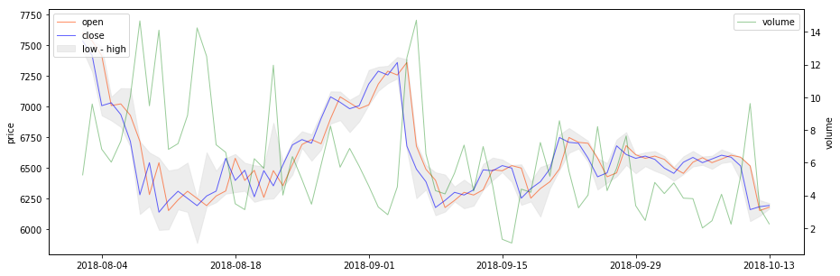

# Capstone Project
Machine Learning Engineer Nanodegree

## I. Definition [1-2 pages]

### Project overview [1-2 paragraphs]

Building **models that can predict the future evolution of easily tradeable financial tools such as stocks, or of crypto-currencies such as Bitcoin**, is a topic of great interest for traders and investors. Such predictions can guide both investment strategies and speculative trading. Using so called **deep leaning techniques** (multi-layered neural networks) to build such models is still in its infancy, and **recurrent neural networks** (RNNs) seem a good fit for this kind time-dependent data. In this report we are interested in building predictive models for trading, investigating whether we can obtain good enough predictions to guide potentially successful trading strategies. The models we are building and tuning are **long short-term memory (LSTM) RNNs**.

These problem we are attacking here is *just one particular case of applying machine learning (ML) to the prediction of time series data.* It is possible that work done on such models could generalize to more "socially useful" time series prediction problems, like *predicting electric energy consumption, water consumption or food prices.*

We will attempt to first **predict the price of Bitcoin (BTC)** in USD based on historical data of medium frequency (5 min) and low frequency (daily) comprised of the regular price values (open, high, low, close) and trading volume, augmented with extra data derived from the S&P 500 Index (SP500) taken as a rough general marker for the "health of US and West-European economy". (A mini-experiment in adding an extra feature representing "Bitcoin related sentiment of recent news" obtained from using Google Clod Natural Language API for sentiment analysis on a subset of news headlines filtered for Bitcoin related keywords was also carried out, but mainly as a proof-of concept for the technique - the actual historical news data was not enough and not diverse enough, and acquiring and processing better quality news data would have increased the scope of this project too much.)

Secondly, we will try to **predict the price of "Bitcoin-involved companies"** (that have either invested in BTC, or are connected to the BTC-ecosystem by producing mining hardware, or by providing relevant services) by using historical data augmented with **features extracted from recent past historical BTC price.**

The data sets used are publicly available historical data for the prices of stock and Bitcoin, acquired from the NASDAQ website, via the GDAX/CoinbasePro API, and from the Bitstamp (a Bitcoin exchange) website, and spans the 2015 - 2018 time interval.

### Problem statement [2-4 paragraphs]

The goals for this project are:
1. To build a model that predicts BTC-USD @ 5 min. future price change direction N points ahead with an accuracy good enough for a possible profitable trading strategy (based on variance we calculate the minimum accuracy required to make profit for a prediction N * 5 min. into the future - details in Metrics section below).
2. To build a model satisfying similar criteria for BTC-USD @ 1 day.
3. To see if the performance of the model BTC-USD @ 1 day can be improved by incorporating features derived from sentiment analysis or news headlines related to Bitcoin.
4. To build a model that predicts the future price of stocks picked from a set of possibly "Bitcoin involved" companies (see point 5.) based on historical daily stock price data(similar performance criteria as mentioned on 1.).
5. To add features derived from the recent evolution of Bitcoin price to the data used for the prediction of "Bitcoin involved companies" stocks' prices and see whether this improves prediction results.

The models will be LSTS RNNs and this project will attempt to identify a suitable network architecture, hyperparameters values, training data size, number of training epochs, and various data pre-processing strategies. Predictive performance will also be compared with two simpler models: a very basic linear-regression based model, and an ARIMA model.

### Metrics [0.5-1 pages]
Broadly speaking, we seek to minimize error and to increase accuracy.

The two most common error measures for regression problems are **mean absolute error (MAE)**:

$$
\text{MAE} = \frac{1}{N} \sum_{t=1}^N {
  | \hat{y_t} - y_t |
}
$$

and **root-mean-square error (RMSE):**

$$
\text{RMSE} = \sqrt {
  \frac {
    \sum_{t=1}^N {
      ( \hat{y_t} - y_t )^2
    }
  }{N}
}
$$

where:
- $t$ represents the index of a data point in the time-series data, corresponding to a moment in time
- $N$ is the total number of data points
- $y_t$ is true value at time/index $t$ (of predicted variable)
- $\hat{y_t}$ is predicted values at $t$

**RMSE is picked here** because it is also usable a loss function for training the RNN (being differentiable), and it thus it makes slightly more sense (despite some of the theoretical advantages of MAE).

RMSE is expressed in the units of the measures quantity, so we'll also use it normalized by the target value to get a unit-less / percentual value, called **mean absolute percentage error (MAPE)**:

$$
\text{MAPE} = \frac{100\%}{N} \sum_{t=1}^N {
  \frac {
    | \hat{y_t} - y_t |
  }{y_t}
}
$$

This will allow us to express statements like *"predicted values is on average within x% of target value"*. Practically speaking RMSE is still a better choice since we can compute things like "RMSE for constant prediction" (eg. "predict that value stays the same") that will also be used as reference, and which can't be computed as MAPE.

Now, practically speaking, in the simplest case, the predicted value would be fed into a trading strategy, which would decide what action to perform (like "buy" or "sell") depending on the predicted direction of the variation. We want to know the percent of the time this predicted direction is correct, the **direction prediction accuracy (DACC):**

$$
\text{DACC} = \frac{1}{N} \sum_{t=1}^{N}{ P_t }
$$

where:

$$
P_t = \begin{cases}
  1 & {
    \text{, if } (y_t - y_{t-k}) (\hat{y_t} - y_{t-k}) > 0
  }
\\
  0 & \text{, otherwise}
\end{cases}
$$

(Here $k$ represents "how many points ago was the last known value" or "how far into the future we are predicting". Therefore $y_{t-k}$ is $y$ at $k$ points ago, or "y at moment since we started predicting" or "start y".)

Based on variance ($\sigma$), we can figure out, under certain assumptions, what would be the **minimal predication accuracy** when predicting a certain interval into the future (given by $k$), **that can form the basis for a profitable trading strategy**. To note that this is in no way a certitude that such a prediction accuracy would drive a strategy that actually makes profit (only that an accuracy below such threshold would be statistically unlikely to have any change of driving a profitable strategy).

With:
- $\varepsilon$ - as the direction accuracy above 50% (eg. $DACC = 0.5 + \varepsilon$)
- $\text{fee}$ - as the percent transaction fee
- $\text{spread}$ - as the bid-ask spread (the difference between the price at which a unit is bough and the price at which it is sold at a moment in time, aka "how much you'd loose if you bough and instantly sold back a unit")
- $\sigma(k)$ - as the standard deviation for $k$ points

Considering that $100 \cdot (0.5 + \varepsilon)$ percent of the times we predict correctly, and $100 \cdot (0.5 - \varepsilon)$ we predict incorrectly, the amount gained on average for trading one unit ends up being $\sigma(0.5 + \varepsilon) - \sigma(0.5 - \varepsilon) = 2 \varepsilon \sigma$. Adding the trading costs and the condition for the profit to be positive we end up with:

$$
\text{Profit}(k, \varepsilon) = 2 \varepsilon \sigma(k) - \text{fee} - \text{spread} \geq 0
$$

$$
\min \varepsilon_{\text{Profit} \geq 0} (k) = \frac{
  \text{fee} + \text{spread}
}{
  2 \sigma(k)
}
$$

$$
\text{MinProfitableDACC}(k) = \frac{
  \text{fee} + \text{spread}
}{
  2 \sigma(k)
} + 0.5
$$

(In our Python code we use `min_eps_ct` for $(\text{fee}+\text{spread})/2$ since it's constant with respect to almost everything else.)

Since we only care about the sign of profit being positive in this discussion, we can take the traded quantity to be $1$ here omit it from the equations. Now we can use this $MinProfitableDACC$ as a **threshold of minimal change direction prediction accuracy that our models should aim to exceed**.

## II. Analysis [2-4 pages]

### Data exploration [1 page]
The datasets used in these project are the following:

#### The BTC-USD Bitcoin historical price datasets

The **300 sec. (5 min.) interval dataset** comprises data collected at this resolution between **1 Feb 2015** and **9 Oct 2018**, obtained from the Coinbase Pro API (formerly GDAX, later acquired by Coinbase). There are **388,209 data points in total**. For 1633 time points of these 5 min. spaced series data was missing, and it filled in using a fill-forward way (a missing data point was filled with the previous in time data point's data). Features for each data point:
- **close (C)** - price at the end of time interval ("closing price")
- **open (O)** - price at the beginning of time interval
- **high (H)** - maximum price reached in interval
- **low (L)** - minimum price reached in interval
- **volume (V)** - amount of currency/stock exchanged in time interval

Higher frequency data set can be available, but historical datasets have lots of missing data points at these resolutions, and acquiring data in real time was not feasible for the time/effort available for this project.

It is worth having a quick look at the overall shape of the data by plotting open and close features, and at the standard deviation for a given "window" (shown here is a window of 100, which also turned out to be a useful one for prediction):

[Fig. 1 - BTC-USD at 5 min. & SD]

The **daily dataset** contains 1351 data points with same features (OHLCV). A similar plot to the one for 5 min data confirm the expectation that the shape of the data is the same:

[Fig. 2 - BTC-USD at 24 h & SD]

(From these plots we can also see obvious and expected facts like the data being non-stationary.)

#### The stock prices datasets

NASDAQ prices for 6 companies (identified by stock ticker symbol) make up 6 datasets of similarly structured OHLCV data. Data was clipped to the 2015-03-02 - 2018-10-12 time interval to ensure we have data for all companies for the same interval.

[Fig. 3 - stocks daily]
Two of these companies, NVidia and AMD, are obviously not what we'd call "Bitcoin involved companies", but theirs stock prices could somewhat correlate with BTC price since they produce hardware relevant for mining.

#### S&P 500 data

For the same interval as for the stocks we have similar OHLC data for the S&P 500 index:

[Fig. 4 - SP500 daily]

### News headlines data

A dataset consisting of 173,372 news headlines for the dates between 2015-02-01 and 2017-12-31.

### Exploratory Visualization [2 page]

The (open, high, low, close, volume) type data for BTC-USD exchange rate and for stock prices can be easily visualized in a compact and simple lines + area chart. These are two examples for BTC-USD at 24 h and at 5 min resolution:

[Fig. 5 - BTC at 24 h OHLC lines chart example]

[Fig. 6 - BTC at 5 min. OHLC lines chart example]

(The volume data is from different exchanges too, hence the units difference, but we're only interested in traded volume variation in general anyway.)

Note the usage of a shaded gray area for the low - high interval, and a secondary axis for the traded volume. Combined with zooming-in and out, this visual representation is pretty good for navigating through the data.

The more traditional "candle-stick" visualization for OHLC data that most traders prefer can also be used:

[Fig. 7 - BTC at 24 h, candlestick chart example]

In a "candlestick" chart the thick box portion spans between open and closing price for an interval, and the thin "whiskers" span to the minimum and maximum that were reached in this interval. Color and/or shading is used to show in which interval the open price was lower than closing price (usually represented green and/or unfilled) or the opposite (usually red and/or filled).

It can also be interesting to visualize an additive decomposition of our time series data (taking only the closing price feature), into (1) trend component (general systematic component that changes over time and does not repeat), (2) seasonal component (changes over time and repeats) and (3) residual/noise component (does not follow any systematic pattern). In the following graph, the blue component (closing price) is the sum of all the others:

[Fig. 8 - BTC at 5 min seasonal additive decomposition: blue - close, green - trend, orange - seasonal, red - residual/noise]

This shows us that there is structure in our data, at multiple levels. But it's doubtful whether this can be of any practical value, but we can see clearly that (a) the data has a trend, and (b) there *could* be some seasonal components.

### Algorithms and Techniques [1 page]

The models developed all belong to a class of **recurrent neural networks** (RNNs) called **long short-term memory (LSTM) RNNs**.

#### Background on NN and RNN algorithms

Neural networks (NNs, aka "artificial neural networks" or ANNs) are computing systems vaguely inspired by the biological neural networks that constitute animal brains. These systems have a set of tunable parameters called *weights* (they could be considered somewhat analogous to "synaptic connection strength" in biological neuronal networks). When combined with an effective learning algorithm, they can be very effective machine learning models. The multi-layered configuration of these models (which spawned an entire sub-field of ML called **deep learning**) is one of the most effective general-purpose tools in ML that also scales well to large volumes of training data.

RNNs are a class of neural networks in which some of the connections for cycles, as opposed to feedforward neural networks which have no cycles in their connections structure. In the simplest such of network formed of 3 layers (sometimes also referred to as 2 layers + input), the practically usable cyclical connection is between the hidden layer units and themselves (or between hidden layer units at $t_k$ and same units at $t_{k-1}$). This leads us to these structures and equations for the simplest possible feedforward and recurrent neural networks that can be of practical use:

[Fig. 9 - Feed-forward NN vs RNN; RNN unfolded through time]

The simple feed-forward NN can be described by an equation such like the following (for the actual practical case of running a *batch* of samples at once through the network, that is closest to the actual code; the ones for one sample are similar but with $x$ and $h$ vectors instead of matrices):

$$
H = f_h(X \cdot W_{xh}) \\
Y = f_y(H \cdot W_{hy})
$$

where $X$ is the input matrix (usually shaped `samples` $\times$ `features`), $W_hx$ is the matrix of weights connecting the input layer with the hidden layer (`features` $\times$ `num_of_hidden_layer_units`), $f_h$ the hidden layer activation function, $H$ is the matrix of hidden layer activations (`samples` $\times$ `num_of_hidden_layer_units`), $W_{hy}$ the matrix of weights from the hidden layer to the output layer (`num_of_hidden_layer_units` $\times$ `num_of_output_layer_units`), $f_h$ the output layer activation function, and $\cdot$ (the dot operator) is matrix multiplication. The activation functions are non-linear. There is also a bias that gets added for every layer, buy we can imagine it's an extra neuron with output fixed to 1, or an extra column of ones added to $X$ and an extra row of weights added to $H$ and so on for following layers except output (or equivalently an extra additive term $b$).

Or in more general form, activation for a layer $l$ of any such simple feed-forward NN is: $ A^l = f\left( A^{l-1} W^l \right) $.

For the RNN the eq. become:

$$
H_t = f_h(X \cdot W_{xh} + H_{t-1} \cdot W_{hh})
    \equiv f_h([X, H_{t-1}] \cdot W_h) \\
Y = f_y(H \cdot W_{hy})
$$

(The $[X, H_{t-1}]$ variant refers to horizontal concatenation of matrices and here $W_h$ means *all* the incoming weights for the hidden layer - it's just two ways of expressing the same mathematical operations.)

Learning in feed-forward neural networks is achieved by computing the gradient of a *loss function* (a good choice for regression problems could be mean-squared-error) with respect to each weight, then updating the weights based on this gradient and a set learning rate. This algorithm is called back-propagation.

The batch/matrix form backpropagation equations for a feed-forward NN end up being (for a layer $l$):

$$
\delta^l = f' \left( A^{l-1} W^l \right) * (\delta^{l+1} \, (W^{l+1})^T) \\
W^l \leftarrow W^l + \eta (A^{l-1})^T \delta^l
$$

Here "$*$" is element-wise multiplication, $\eta$ is the learning rate, and $\delta^l$ are the activation gradients for a layer $l$, and $f'$ is the derivative of the activation function.

A simple way to apply the same learning algorithm to RNNs is by *unfolding them in time*: instead of the original network, we take a network made out of $k$ copies of the original network (for $k$ steps in time to unfold), constrain every copy of the network to share the same parameters, and train the network with a series of $k$ successive ordered training samples.

#### LSTMs

RNNs suffere from the problem of not being able to learn patterns across large intervals of time. A solution to this has been to replace the simple hidden layer of RNNs with "cells": modules composed of multiple layers with specific activation functions and connected in very specific ways, combined with an actual statefull layer that persists state across time, and to which the other layers can write/erase/read.

The first successful RNN cell system has been that called LTST - long short-termn memory. This model integrates a persistent state multiple inner layers called *gates.*

It is best visualized in a diagram (here the green "cell" is what replaces the simple hidden layer from the diagram of the RNN unrolled across time):

[Fig. 10 - LSTM diagram (based on Wikipedia diagram by Guillaume Chevalier from https://en.wikipedia.org/wiki/Long_short-term_memory#/media/File:The_LSTM_cell.png - CC BY 4.0)]

The batch/matrix equations for forward-propagation in a LSTM cell (the operations are all represented in the diagram above) are:

$$
H_t = O_t * \tanh ( C_t ) \\
O_t = \sigma ( [X_t, H_{t-1}] \cdot W_O ) \\
C_t = F_t * C_{t-1} + I_t * \tilde{C_t} \\
F_t = \sigma( [X_t, H_{t-1}] \cdot W_F ) \\
I_t = \sigma( [X_t, H_{t-1}] \cdot W_I ) \\
\tilde{C_t} = \tanh( [X_t, H_{t-1}] \cdot W_C ) \\
$$

The back-propagation-through-time equations can be adapted to this kind of network. No new mathematical insight is needed for this, but the derivation is lengthy, and there's probably room for lots of optimizing tricks at the code level.

#### Chosen implementation

This project has opted to use an established LSTM implementation (**Keras, TensorFlow backend, GPU accelerated**) instead of implementing from scratch a LSTM network based on the equations above. Nevertheless, *the settings have been chosen to have the coded model be faithful to a model represented by the equations above, avoiding the more complex/exotic variations.*

Using Keras it was easy to try out various network architectures (different numbers of units, different numbers of hidden layers, activation function, and dropout layers) quickly, until we find a few that seemed promising.

### Benchmark [1 page]
